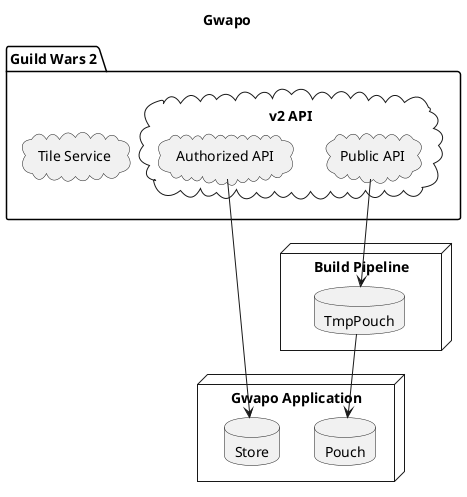

## Getting started

Gwapo is developed against NodeJS v14 LTS.

```bash
git clone git@github.com:bever1337/gwapo.git
cd gwapo
npm install
# source database
# if any scraper script fails, re-run it until it succeeds
node scraper/source-continents.js
node scraper/source-materials.js
node scraper/source-items.js # this one takes a while
# build the database dump
node scraper/dump.js
# start the app!
npm run start
```


