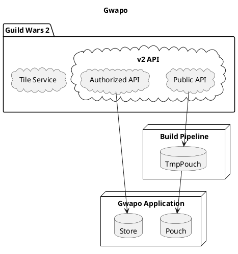

# Gwapo

## Getting started

Gwapo is developed against NodeJS v16 LTS.

```bash
git clone git@github.com:bever1337/gwapo.git
cd gwapo
npm install
# source database
# if any scraper script fails, re-run it until it succeeds
node scraper/source-continents.js
node scraper/source-materials.js
node scraper/source-items.js # this one takes a while
# build the database dump
node scraper/dump.js
# start the app!
npm run start
```

## Proposed Site Map

- /vault
  - /(index as bank) => /v2/account/bank, /v2/account/inventory, /v2/characters, /v2/characters/:id/inventory
  - /materials => /v2/account/materials, /v2/account/inventory, /v2/characters, /v2/characters/:id/inventory
  - /wallet => /v2/account/wallet
  - /wardrobe [Wardrobe 'unlocks' are distinct because they are visible to other players BUT non-functional] => /v2/account/skins, /v2/account/minis, /v2/account/gliders, /v2/account/emotes, /v2/account/dyes, /v2/account/mounts/skins, /v2/account/outfits, /v2/account/novelties, /v2/account/mailcarriers, /v2/account/titles
- /achievements
  - /(index as achievements) => /v2/account/luck [this matches GW2, but is confusing], /v2/account/achievements
  - /home => /v2/account/home/cats, /v2/account/home/nodes
  - /mastery => /v2/account/masteries, /v2/account/mastery/points
  - /mounts => /v2/account/mounts/types
- /crafting => /v2/account/recipes, /v2/characters, /v2/characters/:id/crafting, /v2/characters/:id/recipes
- /daily => /v2/account/dailycrafting, /v2/account/dungeons, /v2/account/mapchests, /v2/account/worldbosses, /v2/account/raids (actually weekly)
- /pvp => /v2/account/buildstorage, /v2/account/finishers, /v2/account/pvp/heroes
- /characters
  - (index as characters) => /v2/characters, /v2/characters/:id/backstory, /v2/characters/:id/core, /v2/account/luck [this is an account-scoped feature, but makes since to live with other stats ???]
  - /training => /v2/characters, /v2/characters/:id/heropoints, /v2/characters/:id/training
  - ? [Should this be /pvp?] => /v2/characters/:id/skills, /v2/characters/:id/specializations, /v2/characters/:id/equipment
  - ? [Should this be /achievements?] => /v2/characters/:id/quests, /v2/characters/:id/sab

## Routes file structure

Follows similar conventions as Gatsby, Next, Astro where the filesystem mocks an HTTP-serving-HTML server.

Routes called `outlet` or routes prefixed with `_` are presentation-only and do not contribute to paths/URLs. Routes prefixed with `:` are dynamic and may match any URL segment.

## Data Flow


