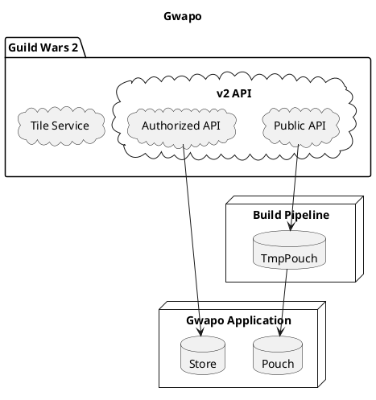

```plantuml
@startuml
title Gwapo

package "Guild Wars 2" {
  cloud "v2 API" {
    cloud "Authorized API"
    cloud "Public API"
  }
  cloud "Tile Service"
}

node "Build Pipeline" {
  database TmpPouch
}

node "Gwapo Application" {
  database Store
  database Pouch
}

"Public API"-->TmpPouch
[TmpPouch]-->Pouch
[Authorized API]-->Store

@enduml
```
