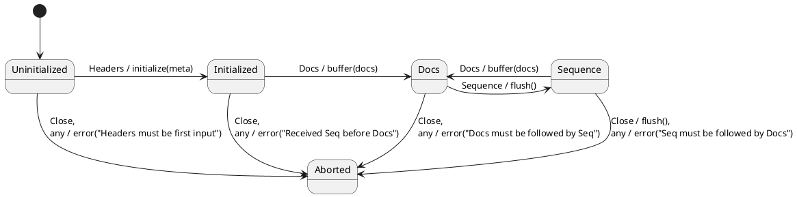

```plantuml
@startuml

[*] --> Uninitialized

state Uninitialized
Uninitialized -r-> Initialized: Headers / initialize(meta)
Uninitialized --> Aborted : Close,\lany / error("Headers must be first input")

state Initialized
Initialized -r-> Docs : Docs / buffer(docs)
Initialized --> Aborted : Close,\lany / error("Received Seq before Docs")

state Docs
Docs -r-> Sequence : Sequence / flush()
Docs --> Aborted : Close,\lany / error("Docs must be followed by Seq")

state Sequence
Sequence -l-> Docs : Docs / buffer(docs)
Sequence --> Aborted : Close / flush(),\lany / error("Seq must be followed by Docs")

state Aborted

@enduml
```
